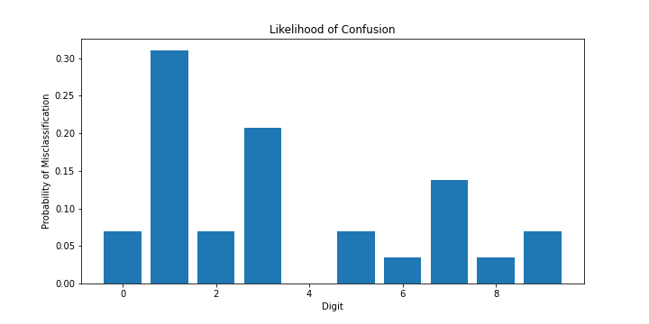
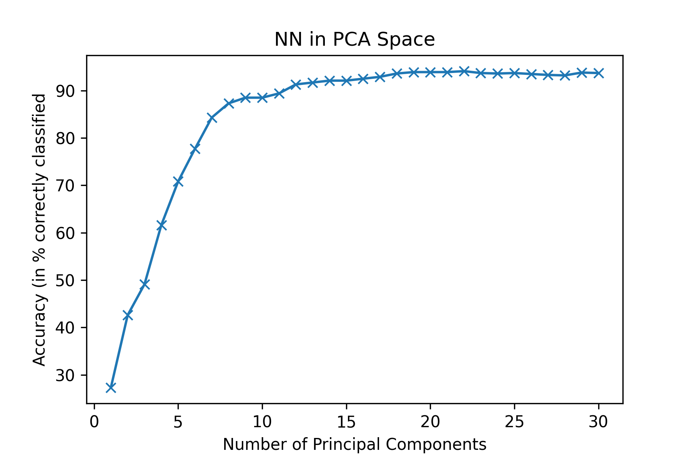

# MNIST Digit Classifier Via KNN (2022)

Implemented a deterministic classifier K-Nearest neighbor using the MNIST, handwritten digit database. Used to create a written digit classifier and predict the correct number based on a given image. Utilized in PCA space and non PCA space.
 
 
## No PCA:

 
## PCA:

